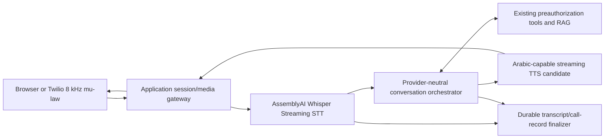
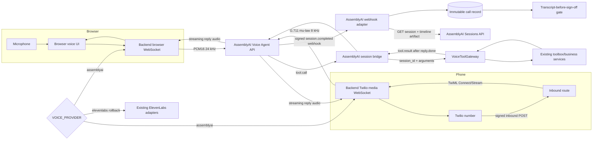

# Voice Provider Migration Log

## Migration

- Source provider: ElevenLabs
- Target provider under evaluation: AssemblyAI
- Working branch: `migration/elevenlabs-to-assemblyai`
- Audit date: 2026-09-19
- Status: Phase 0 and Phase 1 complete; migration paused at the required architectural checkpoint

## Safety Constraints

- Preserve the existing ElevenLabs implementation until a replacement is validated and explicitly approved.
- Do not expose or commit secrets.
- Do not begin AssemblyAI implementation until the TTS/STT capability checkpoint is resolved with the user.
- Keep the migration rollback-safe through parallel implementations or a provider feature flag if implementation is approved.

## Phase 0: Pre-flight Safety Setup

- Git repository confirmed.
- Initial branch: `main`.
- Initial worktree state: clean.
- Migration branch created: `migration/elevenlabs-to-assemblyai`.
- No repository-level `AGENTS.md` instruction file was found.
- This file was created before any product code was changed.

## Phase 1: Current-State Audit

### Audit method and baseline

- Inspected all 156 tracked files plus untracked/ignored configuration filenames.
- Searched case-insensitively for `elevenlabs`, `eleven-labs`, `ElevenLabs`, API hosts, auth headers, ConvAI paths,
  agent/voice/model IDs, STT/TTS terms, audio encodings, WebSockets, callbacks, webhooks, tests, docs and comments.
- Inspected dependency manifests and lock files. There is **no ElevenLabs SDK dependency**. Direct calls use Python's
  standard-library `urllib`; the only hosted runtime dependencies in `pyproject.toml` are the application stack.
- No `.env`, `.elevenlabs-state.json`, or `.hosted/secrets.env` exists in this checkout. Only `.env.example` is
  present. Secret values were neither read nor printed.
- Established a valid pre-change baseline on Windows with UTF-8 enabled and a repository-local pytest temp path:
  **307 tests passed, 5 third-party SQLite deprecation warnings**. An earlier invalid run failed because pytest
  could not access the host temp directory; that environmental run is not a product baseline.
- No product code, dependency, generated API documentation, provider configuration, or business logic was changed.

### Executive finding

The hosted integration is **ElevenLabs Conversational AI**, not an isolated TTS or STT integration. ElevenLabs owns
the full real-time loop: telephony/browser audio, Scribe STT with keyterms, hosted LLM orchestration and fallback,
knowledge-base retrieval, tool-call orchestration, Eleven v3 TTS, turn/session handling, and post-call transcript
delivery. The backend exposes business tools and persists the completed call, but it does not stream hosted audio
itself.

The repository also has a separate local channel (`faster-whisper` + Ollama + Piper). That local channel is not an
ElevenLabs dependency and is not part of the hosted-provider implementation, but its existing `Transcriber` and
`Synthesizer` protocols are potentially reusable if a future, explicitly approved design becomes a custom hybrid.

### Environment variables and provider-owned state

| Name/file | Locations | Purpose | Secret handling / status |
|---|---|---|---|
| `ELEVENLABS_API_KEY` | `.env.example:32-34`; `settings.py:42,61`; `elevenlabs_setup.py:8-11,181-201`; `hosted.py:128-149,370-397`; `twilio_inbound_service.py:71-89` | Authenticates agent/workspace setup and Twilio register-call | Secret; dataclass field is excluded from `repr`; no real value present |
| `PREAUTH_ELEVENLABS_AGENT_ID` | `.env.example:89-91`; `settings.py:43,62`; `hosted.py:391-392,713-724`; `twilio_inbound_service.py:63-89` | Selects the ElevenLabs agent for inbound Twilio calls | Identifier, generated into `.elevenlabs-state.json`; no state file present |
| `PREAUTH_ELEVENLABS_WEBHOOK_SECRET` | `.env.example:92-95`; `settings.py:35-36,58`; `routes/voice.py:75-101`; `hosted.py:557-605`; `verify_deployment.py:8,97,273-307` | HMAC-verifies post-call transcript events | Secret, normally stored in ignored `.hosted/secrets.env`; no real value present |
| `PREAUTH_ELEVENLABS_API_BASE` | `scripts/hosted.py:42` | Optional API-base override used by hosted orchestration | Not documented in `.env.example`; not a secret |
| `PREAUTH_RUNTIME_MODE=elevenlabs` | `settings.py:6-10,37-39,67-73`; `hosted.py:416-422`; `main.py:1-24` | Selects hosted channel; this is the default mode | Provider-coupled enum/default |
| `PREAUTH_VOICE_AGENT_TOKEN` | `.env.example:92-94`; `settings.py:33-34,57`; `routes/voice.py:36-42`; `elevenlabs_setup.py:8-12,179-209`; `hosted.py:401-404` | Bearer token held as an ElevenLabs workspace secret and sent on business-tool calls | Secret; generated into ignored `.hosted/secrets.env` |
| `PREAUTH_PUBLIC_BASE_URL` | `.env.example:60-61`; `settings.py:44-45,63`; setup/hosted/Twilio code | Stable public HTTPS base for tools, post-call webhook, and Twilio signature verification | Not secret; operationally required |
| `.elevenlabs-state.json` | `.gitignore:8`; `.dockerignore:7`; `elevenlabs_setup.py:35-37,202-255`; `hosted.py:37-44,152-157` | Persists secret/tool/document/agent/webhook IDs and content digests for idempotent updates | Ignored; absent in this checkout |
| `.hosted/secrets.env` | `.gitignore:11-12`; `hosted.py:15-17,37-41,120-122` | Generated voice-tool, gateway and webhook secrets | Ignored, chmod `0600`; absent in this checkout |

Related but not ElevenLabs-owned configuration: `TWILIO_AUTH_TOKEN`, `TWILIO_PHONE_NUMBER`, `TWILIO_ACCOUNT_SID`,
`PREAUTH_GATEWAY_SECRET`, tunnel credentials, and database configuration. They must not be removed just because the
voice provider changes.

### Provider/model/audio configuration found

| Setting | Location | Current value/behaviour |
|---|---|---|
| Hosted LLM | `scripts/elevenlabs_setup.py:39-44,109-138,165-175` | `gemini-2.5-flash`, temperature `0.1`; override via `--llm` |
| Hosted STT | `scripts/elevenlabs_setup.py:64-89,132`; `docs/VOICE_AGENT.md:7-18` | ElevenLabs Scribe ASR with up to 100 domain keyterms |
| Hosted TTS | `scripts/elevenlabs_setup.py:41-44,133,165-175` | `eleven_v3_conversational`; fallback documented as `eleven_flash_v2_5` |
| Voice persona | `scripts/elevenlabs_setup.py:42-44,109-138` | Premade voice ID `EXAVITQu4vr4xnSDxMaL`; operator may override with `--voice-id` |
| Audio format | `scripts/elevenlabs_setup.py:47-49,111-133,171-175`; `docs/DEPLOYMENT.md:188-193` | `ulaw_8000` in and out for Twilio; optional `pcm_16000` only when phone calls are excluded |
| Languages | `scripts/elevenlabs_setup.py:51-57,118-136`; `voice/agent_tests.json:76-88` | English default, Arabic language preset and Arabic first message; Arabic call behavior is explicitly tested |
| Built-in conversation tools | `scripts/elevenlabs_setup.py:125-129` | `end_call`, `language_detection` |
| Voice tuning/cloning | repository-wide search | No cloning, `stability`, `similarity_boost`, `style`, or speaker-boost settings found |

### Functional touchpoint map

| File and lines; function/class | Purpose and trigger | Input → expected output | Downstream consumers | Timing/error handling | Category |
|---|---|---|---|---|---|
| `src/preauth/infrastructure/settings.py:6-10,26-73`; `RuntimeMode`, `Settings.from_env` | Default process into hosted ElevenLabs mode at startup and load provider credentials | Environment → immutable settings object | App composition, hosted/Twilio services | Invalid runtime mode fails startup; secrets excluded from `repr` | Conversational AI/config |
| `scripts/elevenlabs_setup.py:39-138`; `keyterms`, `agent_payload` | Build full agent configuration when setup/hosted script runs | Prompt, KB, tool IDs, model, voice, language and audio options → ConvAI agent JSON | ElevenLabs hosted agent | `ulaw_8000` is a hard telephony constraint; no runtime fallback here | STT + LLM + TTS + RAG |
| `src/preauth/agent_tools/elevenlabs.py:15-94`; `request_body_schema`, `webhook_tool_config`, `all_webhook_tool_configs` | Convert the three Pydantic toolbox schemas into ElevenLabs' restricted webhook-tool format | Tool models + public URL + ElevenLabs secret ID → three webhook tool configs | Setup script, hosted agent | Refuses unsupported unions/nesting/missing descriptions; 20 s tool timeout | Tool orchestration |
| `scripts/elevenlabs_setup.py:141-255`; `ElevenLabs.request`, `main` | Create/update workspace secret, tools, KB documents and agent | API key plus generated payloads → provider object IDs saved to state | Hosted agent and future idempotent runs | 60 s HTTP timeout; HTTP errors stop; no retries/backoff; digest reuse avoids redundant uploads | Provisioning |
| `scripts/hosted.py:37-50,125-157,370-422,523-605,679-743`; `elevenlabs`, `preflight`, `setup_agent`, `register_webhook`, `main` | One-command hosted lifecycle: validate, deploy, provision agent, register transcript webhook, expose browser link | `.env`, public URL, generated secrets → live backend/tunnel/agent/webhook | Operator, backend, ElevenLabs workspace | Fail-fast before provider mutation; explicit confirmation before replacing workspace-wide webhook; no automatic API retry | Provisioning/operations |
| `src/preauth/infrastructure/elevenlabs_register_call.py:13-59`; `ElevenLabsRegisterCallClient.register_call` | Register an inbound Twilio call after Twilio hits the backend | `{agent_id, from_number, to_number, direction}` + API key → TwiML containing media-stream WebSocket | Twilio | 10 s timeout inside Twilio's 15 s webhook budget; maps HTTP/network/invalid-TwiML to `RegisterCallError`; no retry | Telephony/full agent |
| `src/preauth/application/twilio_inbound_service.py:27-134`; `TwilioInboundService.handle` and `src/preauth/api/routes/twilio.py:16-46`; `twilio_inbound` | Verify incoming Twilio webhook, register call, return provider TwiML | Signed form body → `application/xml` TwiML | Twilio opens provider media WebSocket; ElevenLabs owns live session | Missing config 503; malformed call 400; bad Twilio signature 401; provider failure returns spoken apology + hangup with HTTP 200 | Telephony/full agent |
| `src/preauth/agent_tools/voice_gateway.py:31-115`; `VoiceToolGateway.call` | Normalize hosted tool arguments, invoke business toolbox, bind conversation to cases | Tool name, flat args, conversation ID → stable `{ok,result/error,guidance}` | ElevenLabs LLM and audit linkage | Business errors remain HTTP 200/actionable; invalid conversation IDs are not linked | Tool orchestration |
| `src/preauth/api/routes/voice.py:32-71`; `voice_tool` | HTTP endpoint called by ElevenLabs mid-conversation for the three business tools | Bearer token, `X-Conversation-ID`, flat JSON → tool response | Hosted LLM continues the call | Missing config 503; invalid token 401; blocking work is handled synchronously | Tool orchestration |
| `src/preauth/infrastructure/elevenlabs_signature.py:13-36`; `sign`, `verify` | Verify ElevenLabs post-call HMAC | Raw body + `elevenlabs-signature` + secret → success/exception | Post-call route | Constant-time compare; rejects malformed, mismatched or older-than-30-minute signatures | Webhook/security |
| `src/preauth/api/routes/voice.py:74-107`; `post_call_webhook` and `src/preauth/application/voice_channel_service.py:32-53,68-79,184-227`; `record_post_call` | Store final provider transcript/analysis and unblock human sign-off | `post_call_transcription` event → immutable `CallRecord` + case audit links | Human review packet and `CALL_RECORD_PENDING` gate | Lenient extra fields; invalid payload 400; bad signature 401; disabled 503; idempotent on conversation ID; ignores other event types | Transcript/audit |
| `scripts/verify_deployment.py:1-9,48-108,270-307` | Exercise the public tool channel and signed transcript webhook before live use | Synthetic conversation + optional secret → pass/fail report | Hosted deployment gate | 30 s HTTP calls; deliberately tests wrong signature and sign-off blocking | Validation |
| `.github/workflows/ci.yml:38-49`; `tests/unit/test_api_docs.py:15-34` | Prove setup dry-run builds valid three-tool, bilingual agent payload | Repository assets → generated payload assertions | CI | Prevents drift in prompt/tools/KB configuration | Test/provisioning |
| `tests/unit/test_elevenlabs.py:1-73` | Verify schema conversion and signature parity | Tool models and signed sample bodies → assertions | CI | Covers unsupported schemas, tamper and staleness | Test |
| `tests/unit/test_elevenlabs_register_call.py:1-69`; `tests/integration/test_twilio_inbound.py:1-157` | Verify register-call auth/body/TwiML, timeout, signature, fallback and log redaction | Fake upstream/Twilio events → XML/error/log assertions | CI | Explicit no-secret-leak and caller-apology behavior | Test/telephony |
| `tests/integration/test_voice_channel.py:1-195` | Verify tool auth/errors, conversation linkage, transcript-before-sign-off, webhook signature/idempotency | Synthetic tool calls and post-call events → DB/audit/review assertions | CI and core business invariant | Covers bad/stale signatures, malformed payload, duplicate delivery, disabled channel | Test/audit |
| `voice/agent_tests.json:1-91` | Manual ElevenLabs dashboard model tests | Five scripted conversations, including Arabic → expected/forbidden calls and language behavior | Operator/model validation | Requires live dashboard runs; pass rate not stored in repository | Test/conversational AI |
| `docs/VOICE_AGENT.md:1-142`, `docs/DEPLOYMENT.md:52-69,149-231`, `docs/API.md:361-410`, `docs/openapi.json:5364-5575`, `README.md:51,148-177,228` | Operator/API documentation for the hosted architecture | N/A | Developers/operators | Must be migrated with code; OpenAPI is generated and CI-checked | Documentation |
| `.gitignore:8-12`, `.dockerignore:6-8`, `.env.example:28-95`, `deploy/huggingface/README.md:19-29` | Prevent provider state/secrets entering Git/images and document deployment secrets | Local/provider artifacts → ignored/excluded | Build and deployment | Rollback depends on preserving these until sign-off | Config/deployment |

Additional textual references that do not introduce another provider call are in `docs/LOCAL_MODE.md`,
`knowledge_base/README.md`, `scripts/generate_uae_knowledge_base.py`, `scripts/simulate_conversations.py`,
`src/preauth/main.py`, local-channel docstrings/diagnostics, and local-mode tests. They contrast the separate local
pipeline with hosted ElevenLabs or direct users back to `scripts/elevenlabs_setup.py`.

### Current hosted architecture

```mermaid
flowchart LR
    Caller[Caller: browser test link or Twilio phone]
    Twilio[Twilio voice webhook]
    Inbound[FastAPI /voice/twilio/inbound]
    Register[ElevenLabs register-call REST]
    Media[Twilio ↔ ElevenLabs media WebSocket\nG.711 μ-law 8 kHz]
    Agent[ElevenLabs Conversational AI session]
    STT[Scribe STT + keyterms\nstreaming]
    LLM[Hosted LLM + fallback\nworkflow + RAG]
    Tools[FastAPI /voice/tools/{name}\nBearer + conversation ID]
    Domain[Shared toolbox → application/domain/rules]
    TTS[Eleven v3 TTS\nstreaming μ-law]
    Hook[Signed post-call transcript webhook]
    Store[CallRecord + case audit\nunblocks human sign-off]

    Caller -->|phone call| Twilio
    Twilio -->|signed form POST| Inbound
    Inbound -->|one register request| Register
    Register -->|TwiML Stream instruction| Twilio
    Twilio <--> Media
    Caller -->|managed browser session| Agent
    Media <--> Agent
    Agent --> STT --> LLM
    LLM <-->|HTTP server tools, 20 s timeout| Tools --> Domain
    LLM --> TTS --> Agent
    Agent -->|spoken audio| Media
    Agent -->|spoken audio| Caller
    Agent -->|call ends; transcript + analysis| Hook --> Store
```

Streaming, buffering and session ownership are intentionally mostly outside this repository. ElevenLabs manages
turn detection, audio chunking, hosted session state, STT partials/finals, LLM fallback, TTS streaming and browser
playback. For phone calls, Twilio follows the provider-generated TwiML and connects to ElevenLabs' WebSocket. The
backend performs one bounded register-call request, then receives discrete HTTP tool calls and one post-call event.

### Non-obvious dependencies and invariants

1. **This is full conversational AI.** Replacing only STT leaves LLM orchestration, workflow, tools, RAG, TTS,
   browser calling, telephony bridging and transcript finalization unresolved.
2. **Arabic is contractual behavior.** The agent has an Arabic preset, Arabic greeting, language detection and an
   explicit Arabic supplier-onboarding test (`voice/agent_tests.json:76-88`).
3. **Telephony format is fixed.** Current phone parity requires G.711 μ-law at 8 kHz both directions. The backend
   deliberately avoids transcoding because ElevenLabs register-call returns a compatible bridge.
4. **Transcript delivery is a safety gate.** Any provider design must reliably finalize and persist the transcript;
   otherwise every case touched by voice remains blocked from human decision with `CALL_RECORD_PENDING`.
5. **Conversation IDs join two asynchronous paths.** ElevenLabs injects `system__conversation_id` into every tool
   request; the later webhook uses the same ID to link the immutable call record to affected cases.
6. **Tool semantics are provider-shaped.** The current adapter emits ElevenLabs' flat webhook schema and secret-ID
   header references. Another provider may use WebSocket tool-call events instead of provider-originated HTTP.
7. **The post-call webhook is workspace-wide.** `hosted.py` requires confirmation before replacing an existing
   workspace webhook because doing so can reroute transcripts for other agents.
8. **The managed browser call is part of UX.** Operators currently receive an ElevenLabs `talk-to` URL; there is no
   hosted web client in this repository for the cloud channel.
9. **No SDK shields response formats.** Provisioning and register-call parse raw provider responses, so provider
   endpoint/payload/error differences are direct migration work.
10. **No production metrics baseline exists in the repository.** Tests validate behavior, not real STT accuracy,
    end-to-end latency, call concurrency or error rate. The docs also state that the setup script has not been run
    against a live account from this checkout (`docs/VOICE_AGENT.md:80-82`). Zero-regression claims therefore need
    real staged calls and agreed acceptance thresholds later.

### Required architectural checkpoint

#### What ElevenLabs is used for

**Answer:** full conversational AI in hosted mode—both directions and the orchestration between them:

- streaming STT (Scribe + keyterms);
- hosted LLM, fallback, workflow and knowledge-base retrieval;
- server-tool orchestration;
- streaming TTS (Eleven v3 and a specific voice persona);
- browser calling and Twilio session/media handling;
- post-call transcript and analysis delivery.

It is not used for voice cloning, and there are no standalone TTS/STT calls in application code.

#### Does AssemblyAI have a direct equivalent?

The master prompt's statement that AssemblyAI has no native TTS is no longer fully current. As checked on
2026-09-19, AssemblyAI's official documentation describes a **Voice Agent API** that provides an integrated
speech-in/speech-out WebSocket with STT, agent reasoning, tool calling and TTS. AssemblyAI still does **not** offer
standalone TTS; TTS exists only inside that integrated Voice Agent API.

Official checkpoint sources:

- Voice Agent API overview: https://www.assemblyai.com/docs/voice-agents/voice-agent-api
- Standalone TTS FAQ: https://www.assemblyai.com/docs/faq/do-you-offer-voice-to-voice-or-text-to-speech-tts
- Voice Agent language/voice support: https://www.assemblyai.com/docs/voice-agents/voice-agent-api/voices
- Twilio integration: https://www.assemblyai.com/docs/voice-agents/voice-agent-api/connect-to-twilio
- Events/tool-call model: https://www.assemblyai.com/docs/voice-agents/voice-agent-api/events-reference

However, it is **not a drop-in equivalent for this project's current behavior**:

| Current dependency | AssemblyAI checkpoint finding | Parity status |
|---|---|---|
| English + Arabic conversational input/output | Voice Agent API input supports English, French, German, Italian, Portuguese and Spanish; output adds Hindi, Japanese, Korean, Mandarin and Russian. Arabic is not listed. | **Blocking gap** |
| Full speech-in/speech-out agent | Voice Agent API supplies an integrated STT/agent/TTS WebSocket. | Candidate equivalent, not yet validated |
| ElevenLabs register-call (one REST request returning provider TwiML) | AssemblyAI's Twilio guide requires this application to host a Twilio Media Streams WebSocket and relay audio/events to a parallel AssemblyAI WebSocket. | Major architecture change |
| Provider-originated HTTP server tools | AssemblyAI sends `tool.call` events on the live WebSocket; the client returns `tool.result`. | Adapter/relay required |
| Managed `talk-to` browser URL | Official browser integration requires a server-minted temporary token and a browser WebSocket/audio client. | New UI/token endpoint required |
| Signed post-call transcript + analysis webhook | Streaming STT documents final-transcript webhooks; Voice Agent API exposes live transcript events. Exact post-call analysis parity is not established in this Phase 1 checkpoint. | Unresolved; must be designed/verified |
| `ulaw_8000` Twilio audio | Voice Agent Twilio guide supports `audio/pcmu` both directions without transcoding. | Promising direct format match |

### Risk decision and stop condition

The migration as literally scoped cannot yet guarantee 100% UX/functional parity because Arabic behavior is in use
and the currently documented AssemblyAI Voice Agent API does not support Arabic input or output. Even for an
English-only scope, replacing ElevenLabs requires a materially different live WebSocket relay architecture rather
than swapping an SDK call.

Per the required checkpoint, **implementation and Phase 2 are stopped**. No AssemblyAI dependency, environment
variable, adapter, route, feature flag or product-code change has been added.

### Options requiring user direction

1. **Preserve all behavior:** keep ElevenLabs for the hosted agent until a provider architecture with Arabic STT
   and TTS is selected. AssemblyAI could be considered only as the STT component of a custom cascade, paired with
   a separate LLM/orchestrator and an Arabic-capable TTS provider. Provider selection and tradeoffs belong in Phase
   2 after scope confirmation.
2. **AssemblyAI Voice Agent API, English-only:** explicitly remove Arabic parity as a requirement and approve a
   larger architecture change: backend Twilio/media relay, WebSocket tool adapter, transcript finalization and a
   hosted browser client/token endpoint.
3. **STT-only scope:** clarify that the intended migration is only the separate local channel's STT
   (`faster-whisper` → AssemblyAI), leaving hosted ElevenLabs TTS/conversation functionality untouched. This is not
   an ElevenLabs-to-AssemblyAI replacement of the current hosted channel.
4. **Hybrid hosted stack:** use AssemblyAI Streaming STT plus an explicitly selected TTS provider and LLM
   orchestration. This preserves the possibility of Arabic but is a new custom conversational stack, not a direct
   provider swap.

Decision needed before Phase 2: choose whether Arabic/full hosted parity remains mandatory, whether English-only
AssemblyAI Voice Agent is acceptable, whether the scope is STT-only, or whether a hybrid stack should be evaluated.

---

## Phase 2 — AssemblyAI capability research and recommendation

**Research date:** 2026-09-19  
**Status:** Completed as a read-only recommendation study. No migration implementation was performed.

### Source and version note

This assessment uses current first-party AssemblyAI documentation and product material. The Voice Agent API is
evolving quickly, and current first-party pages are not completely synchronized: older integration documentation
describes an application-hosted Twilio Media Streams relay, while AssemblyAI's September 2026 product material
describes direct SIP connectivity and imported phone numbers. Likewise, recent first-party pages differ on the
number of supported Voice Agent input languages. These discrepancies must be resolved with an account-level proof
of capability before a production design depends on either feature. They do not change the main conclusion:
AssemblyAI does not currently document Arabic speech output for its managed Voice Agent API.

Primary sources consulted:

- Voice Agent API overview: https://www.assemblyai.com/docs/voice-agents/voice-agent-api
- Voice Agent session configuration: https://www.assemblyai.com/docs/voice-agents/voice-agent-api/session-configuration
- Voice Agent events: https://www.assemblyai.com/docs/voice-agents/voice-agent-api/events-reference
- Browser authentication: https://www.assemblyai.com/docs/voice-agents/voice-agent-api/browser-integration
- Voice and language support: https://www.assemblyai.com/docs/voice-agents/voice-agent-api/voices
- Voice Agent pricing/product page: https://www.assemblyai.com/products/voice-agent-api
- Current SIP/telephony product detail: https://www.assemblyai.com/blog/whats-actually-inside-the-voice-agent-api
- Current Twilio/SIP example: https://www.assemblyai.com/blog/build-voice-agent-twilio-assemblyai
- Older Twilio Media Streams integration: https://www.assemblyai.com/docs/voice-agents/voice-agent-api/connect-to-twilio
- Standalone TTS FAQ: https://www.assemblyai.com/docs/faq/do-you-offer-voice-to-voice-or-text-to-speech-tts
- Streaming STT product and pricing: https://www.assemblyai.com/products/streaming-speech-to-text and
  https://www.assemblyai.com/pricing/
- Streaming audio/protocol guidance: https://www.assemblyai.com/docs/coding-agent-prompts
- Streaming message sequence and closures:
  https://www.assemblyai.com/docs/streaming/message-sequence and
  https://www.assemblyai.com/docs/streaming/common-session-errors-and-closures
- Multilingual streaming transcription: https://www.assemblyai.com/docs/universal-streaming/multilingual-transcription
- Streaming webhook behavior: https://www.assemblyai.com/docs/streaming/webhooks
- LLM Gateway overview, tool calling and fallback:
  https://www.assemblyai.com/docs/lemur/summarize-audio/,
  https://www.assemblyai.com/docs/llm-gateway/tool-calling and
  https://www.assemblyai.com/docs/llm-gateway/fallback
- Speech Understanding and PII redaction:
  https://www.assemblyai.com/docs/speech-understanding/getting-started and
  https://www.assemblyai.com/docs/guardrails/redact-pii-from-transcripts

### Capability findings

| Capability | Current AssemblyAI offering | Migration relevance |
|---|---|---|
| Managed conversational speech | Voice Agent API: one WebSocket for STT, reasoning, tools, barge-in/turn handling and integrated TTS | Closest structural match to ElevenLabs Conversational AI |
| Standalone TTS | Not offered; speech synthesis is available only inside Voice Agent API | Prevents using AssemblyAI as a drop-in replacement for the app's TTS layer |
| Arabic speech input | Whisper Streaming documents Arabic and automatic language detection | Feasible in a custom STT pipeline; must benchmark domain terms and code-switching |
| Arabic speech output | Not listed for Voice Agent API | **Blocking gap for current English/Arabic parity** |
| Telephony audio | Streaming supports 8 kHz mono μ-law input without upsampling; Voice Agent supports telephony/SIP paths | Current Twilio media format can be preserved; exact managed SIP account capability must be verified |
| Partial/final transcripts | Streaming v3 emits turn updates and final `end_of_turn` events | Can drive the existing transcript lifecycle through an adapter |
| Browser access | Short-lived, single-use server-minted tokens plus browser WebSocket client | Requires a new browser client/token endpoint; no equivalent hosted `talk-to` URL was established |
| Tool calling | Voice Agent emits `tool.call` and expects `tool.result`; LLM Gateway also exposes OpenAI-style tool calls | Existing HTTP tool registry needs an adapter or new live session owner |
| Post-call records | Current product material describes stored sessions/call artifacts and signed webhook events; streaming STT separately documents final-turn webhooks | Promising, but must prove stable correlation, signatures, retry behavior and transcript completeness in a sandbox |
| Session recovery | Voice Agent advertises a 30-second resume window | Helpful but not equivalent to a durable call-record guarantee; application reconciliation remains necessary |
| Latency | Voice Agent markets roughly one-second end-to-end latency; streaming accepts 50–1000 ms chunks and markets transcripts within hundreds of milliseconds | Marketing figures are not a parity baseline; measure on Twilio calls in the deployment region |
| Pricing/concurrency | Voice Agent lists $4.50/hour all-in; Streaming STT lists $0.15/hour plus optional keyterms. Streaming session-start limits depend on tier | Hybrid pricing must add LLM, TTS, hosting and egress; concurrency must be verified against the target account |
| Audio intelligence | Sentiment, summaries, entities, topics, diarization and PII redaction are available for recorded transcription | Do not add during parity migration; they change outputs, cost, latency and audit semantics |

### Gap analysis

| ElevenLabs feature/call | Purpose in this application | AssemblyAI equivalent | Gap / notes |
|---|---|---|---|
| Conversational AI agent with Scribe, LLM and Eleven v3 | Entire hosted speech loop | Voice Agent API | Candidate only for supported-language calls; Arabic output blocks full replacement |
| `language_presets.ar` and Arabic greeting | Arabic caller experience | Whisper Streaming can transcribe Arabic | No managed Arabic TTS voice, so a separate TTS provider/custom cascade is required |
| `agent_id` hosted `talk-to` URL | Zero-maintenance browser call UX | Temporary token + browser WebSocket/audio client | New frontend and backend token endpoint; UX is not drop-in |
| Register-call endpoint returning TwiML | Connect Twilio without app-owned media | Current material describes SIP connectivity; older guide uses a dual-WebSocket relay | Provider documentation conflict; validate direct SIP availability and exact API before choosing topology |
| `ulaw_8000` | Native Twilio audio in both directions | Streaming accepts `pcm_mulaw` at 8 kHz; managed voice supports telephony audio | Input match is strong; external TTS output format may require conversion |
| ElevenLabs server tools | Provider calls existing backend endpoints | `tool.call`/`tool.result`, and current Voice Agent material also describes HTTP tools | Schema/auth/correlation adapter required; do not expose internal tools directly without equivalent authentication |
| LLM primary/fallback | Managed reasoning resilience | Voice Agent managed reasoning or LLM Gateway fallbacks | Custom hybrid must own message history, tool loop, cancellation and retry behavior |
| Post-call signed transcript webhook | Immutable call record and sign-off safety gate | Stored call/session webhook capability is described in current product material; streaming has finalized-turn webhooks | Must validate signature, delivery/retry, transcript URL lifetime and recovery before parity can be claimed |
| Voice ID / persona | Branded caller voice | Managed supported voices, or separate TTS voice | No 1:1 voice mapping or clone migration; stakeholder voice approval is required |
| STT keyterms | Policy IDs, procedure codes and domain names | Universal Streaming offers keyterms; Whisper Streaming supplies the Arabic coverage | A single model may not provide both required Arabic coverage and identical keyterm behavior; benchmark is mandatory |

### External TTS options for a hybrid stack

AssemblyAI cannot fill the Arabic output role by itself. These are candidates for a controlled evaluation, not a
provider selection:

| Candidate | Evidence relevant to this app | Main tradeoff |
|---|---|---|
| Azure AI Speech | Official catalog includes UAE Arabic voices (`ar-AE-FatimaNeural`, `ar-AE-HamdanNeural`) and many Arabic locales; Microsoft documents streaming/first-byte latency techniques | Strongest documented locale fit; adds a second vendor, key/billing surface and possible telephony transcoding |
| Google Cloud Text-to-Speech | Official catalog includes many Modern Standard Arabic (`ar-XA`) voices and bidirectional streaming support | Streaming synthesis is documented as Pre-GA for the supported streaming voice family, increasing production-support risk |
| Amazon Polly | Official catalog includes Gulf Arabic neural voices and a synchronous API that streams audio bytes | Mature/simple integration, but conversational naturalness and interruption latency must be benchmarked against the current voice |
| Existing Piper path | Already abstracted in this repository and can run offline | Current configured voice is English; Arabic voice availability/quality and sentence-level latency are unverified and unlikely to preserve hosted UX without substantial work |

First-party comparison sources:

- Azure voices and latency: https://learn.microsoft.com/en-sg/azure/ai-services/speech-service/language-support?tabs=tts
  and https://learn.microsoft.com/en-us/azure/ai-services/speech-service/how-to-lower-speech-synthesis-latency
- Google voices and streaming: https://cloud.google.com/text-to-speech/docs/voices and
  https://docs.cloud.google.com/text-to-speech/docs/create-audio-text-streaming
- Amazon Polly voices and streaming response API: https://docs.aws.amazon.com/polly/latest/dg/available-voices.html
  and https://docs.aws.amazon.com/polly/latest/APIReference/API_SynthesizeSpeech.html

No provider should be selected without blind voice-quality review, Arabic/English code-switch tests, first-audio and
end-to-end latency measurement, cancellation/barge-in tests, and Twilio codec validation using representative calls.

### Recommendations, ranked

#### 1. Preserve the current hosted system for now — recommended under the stated constraints

Do not replace the production ElevenLabs hosted channel yet. This is the only recommendation consistent with the
simultaneous requirements of 100% behavior/UX parity, English and Arabic speech output, and no unproven regression.
Retain ElevenLabs and use the branch/log as the migration baseline while a target architecture is approved and
benchmarked. This is a risk decision, not a claim that AssemblyAI is unsuitable for every part of the system.

#### 2. If removing ElevenLabs is mandatory, approve a hybrid evaluation

The most credible parity path is a custom cascade:



Evaluate Azure AI Speech first because it has the clearest documented UAE Arabic voice fit, but keep Google Cloud
TTS and Amazon Polly in the benchmark. This is deliberately not a final selection. The hybrid option materially
changes architecture and transfers turn management, cancellation, barge-in, retries, session recovery, browser
audio, telephony media and transcript reconciliation into this application. It therefore needs a measured prototype
before Phase 3 can promise parity.

#### 3. If spoken Arabic can be removed from scope, use AssemblyAI's managed Voice Agent API

This is the closest operational replacement for the hosted ElevenLabs product and minimizes custom real-time audio
orchestration. Before design, prove in the target account: supported languages/voices, direct SIP or phone-number
APIs, HTTP tool authentication, signed post-call artifacts, browser integration, session recovery, latency and
concurrency. This option explicitly changes product behavior and cannot be treated as a transparent migration.

#### 4. If the real requirement is STT modernization only, narrow the project

Use AssemblyAI Whisper Streaming for Arabic-capable streaming STT and leave the ElevenLabs hosted conversational
channel intact. This is a useful, lower-risk project for the local speech channel, but it is not an
ElevenLabs-to-AssemblyAI replacement.

### Phase 2 stop condition

No architecture, dependency, environment-variable contract or implementation plan is approved yet. Phase 3 must
not begin until the stakeholder explicitly chooses one scope:

1. preserve ElevenLabs pending parity;
2. evaluate/design a hybrid AssemblyAI STT + separate Arabic TTS stack;
3. accept an English-only managed AssemblyAI Voice Agent migration; or
4. narrow the work to STT only.

---

## Scope decision — 2026-09-19

The stakeholder explicitly approved removing Arabic support completely and migrating the hosted voice channel to
AssemblyAI. The target is therefore an **English-only AssemblyAI Voice Agent**. Arabic prompts, presets, claims,
tests and documentation will be removed from both hosted and local voice-channel behavior. Non-English callers
will be handled by the existing unsupported-language/human-escalation behavior rather than an Arabic reply path.

This decision resolves the Phase 1 architectural checkpoint. It does not authorize premature deletion of the
ElevenLabs rollback implementation; that remains available behind a feature flag until Phase 5 validation and
stakeholder sign-off.

---

## Phase 3 — Migration design

**Status:** Design complete; implementation has not started. Explicit approval is required before Phase 4.

### Design decision

Use AssemblyAI's stored Voice Agent API for STT, LLM reasoning, tool calling, turn detection and TTS, with this
application acting as a thin, provider-neutral real-time transport and trusted tool executor.

AssemblyAI offers managed SIP and server-side HTTP tools, but that path does not provide a documented, immutable
session identifier on every HTTP tool request. This application must associate every case-changing tool call with
the exact session before human sign-off is allowed. Passing a session id through the model as a tool argument would
make a safety control depend on model compliance. The selected design therefore handles AssemblyAI function-tool
events on a backend-owned WebSocket. The backend obtains `session_id` directly from `session.ready` and binds it to
every tool invocation without exposing tool credentials to the browser.

The bridge also avoids two other regressions:

- the browser never receives `ASSEMBLYAI_API_KEY` or `PREAUTH_VOICE_AGENT_TOKEN`;
- Twilio continues to use its existing signed inbound webhook and native 8 kHz G.711 μ-law media, with no phone
  number/SIP-trunk cutover required during the validation period.

### Proposed architecture



Streaming behavior:

- Browser capture is resampled to PCM16 mono at 24 kHz in an AudioWorklet; streamed audio and reply frames are
  proxied without persistence.
- Twilio media remains PCMU at 8 kHz end-to-end; no transcoding is added.
- `input.speech.started` clears buffered Twilio/browser playback to preserve barge-in.
- `tool.call` results are buffered until `reply.done`, matching AssemblyAI's required event ordering.
- The AssemblyAI connection is closed with `session.end`; reconnects within 30 seconds use `session.resume` where
  the upstream client is still present.

### Provider abstraction

Keep the existing business interfaces and introduce provider-specific transport adapters:

1. `VoiceProvider` enum selected by `VOICE_PROVIDER=elevenlabs|assemblyai`.
2. Provider-neutral tool-schema generation from `agent_tools.toolbox.TOOLS`.
3. `AssemblyAISessionBridge` owns WebSocket protocol, audio forwarding, `session_id`, tool events, error mapping and
   observability. It calls the existing `VoiceToolGateway`; business services do not gain provider awareness.
4. `CallRecordInput` (or equivalent provider-neutral method) becomes the common input to immutable call recording.
   ElevenLabs and AssemblyAI webhook payloads are adapted to it separately.
5. `TwilioInboundService` selects an inbound strategy. ElevenLabs continues using register-call; AssemblyAI returns
   locally generated TwiML containing a short-lived, signed media-stream URL.

### AssemblyAI agent configuration

Create two stored AssemblyAI agents from the same English prompt and function-tool definitions:

| Agent | Input/output format | Deployment |
|---|---|---|
| Browser | PCM16 mono, 24 kHz | Backend-proxied browser WebSocket |
| Phone | G.711 PCMU, 8 kHz | Backend Twilio Media Streams bridge |

Two agent records avoid runtime transcoding and avoid attempting to mutate the immutable output format after a
stored agent is loaded. Both use the selected AssemblyAI English voice and the same source-controlled behavior.

The LLM configuration will point the Voice Agent at AssemblyAI LLM Gateway using `gemini-2.5-flash`, preserving the
current primary model family while keeping one AssemblyAI credential/billing surface. AssemblyAI's Voice Agent
custom-LLM field currently accepts one configuration and does not expose LLM Gateway fallback request parameters,
so the existing explicit secondary Gemini model cannot be reproduced through the stored-agent contract. The
Gateway's default retry remains, and failure behavior will be tested. This is a documented reliability difference,
not a silent parity claim.

### Post-call and safety-gate design

Register `session.completed` subscriptions for both stored agent ids. The webhook will:

1. verify `X-AAI-Signature` over the raw body with HMAC-SHA256 and a five-minute replay window;
2. validate `event_id`, `session_id`, `agent_id` and event type;
3. fetch `GET /v1/sessions/{session_id}`;
4. if artifacts are not ready, return a retryable 503 so AssemblyAI retries delivery;
5. download the short-lived timeline artifact, normalize its turns, and create the immutable call record;
6. deduplicate by `session_id`/conversation id and link every case touched by the bridge's tool invocations;
7. return 2xx only after the record is durable.

A reconciliation command will list completed sessions for the two configured agent ids and ingest any session that
does not yet have a call record. This covers exhausted/missed webhook delivery without weakening
`CALL_RECORD_PENDING`.

### Environment and state changes

New variables:

| Variable | Secret | Purpose |
|---|---:|---|
| `VOICE_PROVIDER` | No | Transition flag: `elevenlabs` or `assemblyai` |
| `ASSEMBLYAI_API_KEY` | Yes | Voice Agent REST/WebSocket, Sessions API and LLM Gateway authentication |
| `PREAUTH_ASSEMBLYAI_WEBHOOK_SECRET` | Yes | Verifies signed AssemblyAI webhook deliveries |
| `PREAUTH_ASSEMBLYAI_MEDIA_SECRET` | Yes | Signs short-lived Twilio media WebSocket URLs; independent of the webhook secret |
| `PREAUTH_ASSEMBLYAI_BROWSER_AGENT_ID` | No | Stored PCM browser agent; generated by setup |
| `PREAUTH_ASSEMBLYAI_PHONE_AGENT_ID` | No | Stored PCMU phone agent; generated by setup |
| `PREAUTH_ASSEMBLYAI_VOICE_ID` | No | English voice selection; configurable because no ElevenLabs voice-id mapping exists |
| `PREAUTH_ASSEMBLYAI_LLM_MODEL` | No | Defaults to `gemini-2.5-flash` |
| `PREAUTH_ASSEMBLYAI_API_BASE` | No | Optional test/region override; production default is the official endpoint |
| `PREAUTH_ASSEMBLYAI_WS_URL` | No | Optional test/region override; production default is the official endpoint |

Existing variables retained during transition: all ElevenLabs variables, `PREAUTH_VOICE_AGENT_TOKEN`, Twilio
credentials, `PREAUTH_PUBLIC_BASE_URL`, database/tunnel settings and local-mode settings. No secrets will be
committed. Generated ids live in git-ignored `.assemblyai-state.json`; generated webhook secrets remain in
`.hosted/secrets.env`.

### Dependency changes

- Add a bounded `websockets` runtime dependency for the outbound AssemblyAI WebSocket. FastAPI continues to own
  inbound browser/Twilio WebSockets.
- Do not add the AssemblyAI SDK: its REST resources are small, the repository already uses explicit provider
  clients, and raw contracts make error/timeout behavior testable.
- Do not remove any ElevenLabs package: none is installed. Existing ElevenLabs modules remain until Phase 5 sign-off.

### Planned file-level changes

- Add AssemblyAI tool schema, REST client, signature verification, session bridge, artifact adapter and setup/reconcile
  modules under `src/preauth/`, `scripts/` and `tests/`.
- Extend `settings.py`, app construction, error mapping and observability with provider-neutral configuration.
- Add browser voice UI/AudioWorklet files and AssemblyAI browser/Twilio WebSocket routes.
- Refactor call-record ingestion to accept provider-neutral normalized data without changing database schema or
  sign-off semantics.
- Feature-flag `scripts/hosted.py` and `.env.example`, preserving the ElevenLabs path during validation.
- Remove Arabic behavior from both voice prompts, the ElevenLabs language preset, agent tests, README and voice/local
  documentation. Replace Arabic claims with English-only/unsupported-language behavior.
- Regenerate API documentation only after routes stabilize.

### Small, testable commit sequence

1. **`docs: approve English-only AssemblyAI migration scope`** — record the decision and architecture; no runtime change.
2. **`feat: add provider-neutral hosted voice configuration`** — `VOICE_PROVIDER`, settings validation, adapter
   boundaries and unchanged ElevenLabs default.
3. **`feat: add AssemblyAI agent provisioning`** — tool-schema adapter, REST client, two stored agents, webhook
   subscription, dry-run/state handling and unit tests.
4. **`feat: bridge AssemblyAI realtime voice sessions`** — common bridge, browser PCM path, Twilio PCMU path,
   secure correlation, barge-in, error/reconnect behavior and protocol tests.
5. **`feat: ingest AssemblyAI session transcripts`** — signature verification, artifact retrieval/normalization,
   provider-neutral call records, retry/reconciliation and safety-gate tests.
6. **`chore: remove Arabic voice support`** — prompts, presets, tests and documentation become explicitly English-only.
7. **`test: validate AssemblyAI migration behind provider flag`** — full offline suite, mocked network/drop/rate/error
   cases, generated API docs and hosted dry-run.
8. **`docs: make AssemblyAI the documented hosted provider`** — `.env.example`, README, deployment, architecture and
   operational rollback instructions. Switch the example/default only after offline tests pass.

No ElevenLabs deletion is included. That is a separate cleanup commit after live Phase 5 acceptance.

### Verification gates

Offline gates:

- the full existing test suite remains green;
- deterministic contract tests cover both audio formats and every AssemblyAI event/error path used;
- invalid Twilio/webhook/media tokens are rejected;
- provider credentials never appear in client assets, exceptions or logs;
- tool calls remain unable to make final approval/denial decisions;
- a case remains blocked while its AssemblyAI session transcript is pending;
- duplicate/out-of-order webhooks cannot duplicate records or audit events;
- ElevenLabs remains selectable for rollback until sign-off.

Live gates requiring real credentials and representative English audio:

- browser and Twilio end-to-end calls;
- voice-persona approval (`PREAUTH_ASSEMBLYAI_VOICE_ID` has no automatic equivalent);
- policy/member/procedure identifier accuracy and keyterm effectiveness;
- first-transcript, first-audio, turn and tool latency against an ElevenLabs baseline;
- barge-in, silence, background noise, disconnect/resume, upstream error and concurrent-call behavior;
- webhook delay/retry and manual reconciliation;
- no sign-off before the corresponding call record exists.

### Rollback

Set `VOICE_PROVIDER=elevenlabs`, restore the existing Twilio webhook target if it was changed, and restart. The
ElevenLabs source, state file, environment variables, webhook route and tests remain intact through validation.
AssemblyAI agent/subscription records are not deleted by rollback. Cleanup requires a separate, explicit Phase 6
approval after measured acceptance.

### Risks requiring acknowledgement

1. Arabic capability is intentionally removed by stakeholder decision.
2. The voice persona cannot be mapped automatically; an AssemblyAI English voice must be selected and approved.
3. The explicit ElevenLabs secondary LLM cannot be expressed in AssemblyAI's current stored-agent custom-LLM
   contract; the design preserves the primary Gemini family and uses Gateway retry, then measures failure behavior.
4. Real latency, audio quality and provider reliability cannot be proven without an AssemblyAI key and live calls.
5. Browser calling changes from a hosted provider URL to an application-hosted page, while retaining the same
   start/talk/hear interaction.

### Phase 3 stop condition

The user approved this plan and explicitly directed the migration to continue on 2026-09-19.

## Phase 4 implementation log

### Realtime bridge (plan step 4)

- Added a server-owned AssemblyAI WebSocket bridge for the stored browser and phone agents. The AssemblyAI API key
  never reaches browser JavaScript or Twilio.
- Added an English-only browser console using mono PCM16 at 24 kHz, echo cancellation, streamed playback,
  transcript events and barge-in playback cancellation.
- Preserved Twilio's signed inbound webhook. In AssemblyAI mode it now returns local TwiML with a 90-second HMAC
  media token bound to the Twilio `CallSid`; the WebSocket verifies that identity again on Twilio's `start` event.
- The phone bridge forwards native PCMU at 8 kHz without transcoding and clears Twilio's audio buffer on
  `input.speech.started`.
- Function calls execute through the existing `VoiceToolGateway` using the authoritative AssemblyAI `session_id`.
  Results are buffered until a non-interrupted `reply.done`; interrupted replies discard pending results.
- ElevenLabs register-call behavior remains unchanged behind `VOICE_PROVIDER=elevenlabs`.
- Added bounded `websockets` runtime dependency and deterministic protocol/security tests.

Verification: 41 focused tests passed on 2026-09-19. Live audio, latency, network-drop/resume and provider error
behavior still require AssemblyAI credentials during Phase 5.

### Session transcript ingestion (plan step 5)

- Added the signed `POST /api/v1/voice/assemblyai/post-call` endpoint. It verifies `X-AAI-Signature` against the
  unmodified request body with HMAC-SHA256, rejects timestamps outside a five-minute replay window, and accepts
  both top-level and nested session identifiers used by AssemblyAI event envelopes.
- The notification is never treated as the authoritative transcript. The service fetches the completed session,
  downloads the pre-signed timeline artifact without attaching the API credential, and normalizes caller, agent
  and function-tool turns into the existing immutable call-record format.
- Missing timeline artifacts return `503 WEBHOOK_ARTIFACT_PENDING`, allowing AssemblyAI delivery retries. REST or
  artifact failures return `503 VOICE_PROVIDER_UNAVAILABLE`; malformed or unauthenticated events remain terminal
  400/401 responses.
- Call records use the AssemblyAI `session_id` as the existing conversation correlation key. This is the same id
  used by the realtime tool bridge, so every affected case remains blocked by `CALL_RECORD_PENDING` until the
  matching transcript is durable. Duplicate events are idempotent and do not duplicate audit entries.
- Stored analysis includes interruption, tool-call/error, user-confidence and first-audio aggregates. Short-lived
  pre-signed artifact URLs are not persisted.
- Added `scripts/assemblyai_reconcile.py` to page through completed sessions and invoke the same idempotent ingest
  path after missed or exhausted webhook deliveries.
- Corrected Voice Agent REST authentication to the documented raw API-key header. The realtime WebSocket keeps its
  documented Bearer authentication; these provider surfaces intentionally differ.

Verification: 38 focused unit, integration, architecture and legacy voice-channel tests passed on 2026-09-19.
Live webhook timing and reconciliation still require real AssemblyAI credentials during Phase 5.

### English-only voice scope (plan step 6)

- Removed the non-English voice preset, alternate first message and automatic language-switching tool from the
  retained ElevenLabs rollback provisioner. Rollback now preserves business continuity without reintroducing the
  removed language behavior.
- Both hosted and local system prompts now explicitly require English responses. A caller who cannot continue in
  English is routed to `OUT_OF_SCOPE` human follow-up; the agent must not translate or continue automated intake.
- Replaced the non-English dashboard scenario with an English-only unsupported-language callback test.
- The local audio endpoint no longer accepts a caller-selectable language hint. Local transcription is explicitly
  pinned to English, matching the hosted AssemblyAI target.
- Removed bilingual product claims, non-English branding copy and obsolete setup instructions from current user
  documentation. Generic human-callback language metadata remains because it routes work to a person rather than
  claiming automated voice support.

Historical discovery and decision records above intentionally retain references to the capability that was found
and removed. They are audit evidence, not current product behavior.

### Offline validation and hosted cutover (plan steps 7–8)

- Ran the complete repository suite after the realtime, post-call and English-only changes: **340 tests passed**
  on 2026-09-19. Warnings were limited to SQLAlchemy's upstream SQLite datetime adapter deprecation and a local
  Windows pytest-cache filesystem warning; neither affected application behavior.
- Made AssemblyAI the application and `.env.example` hosted default. `PREAUTH_RUNTIME_MODE=hosted` replaces the
  provider-named runtime default; the former `elevenlabs` runtime value is still accepted for existing deployments.
- Made `scripts/run_hosted.sh` provider-aware. Its AssemblyAI path validates the API key, generates independent
  webhook/media secrets, creates or updates both stored agents and subscriptions, loads their ids, restarts the
  backend when needed, verifies Twilio signature enforcement and prints the application-hosted `/voice` URL.
- Updated deployment verification for the AssemblyAI signed-webhook boundary. It deliberately does not fabricate
  a provider session: authoritative transcript retrieval requires a real AssemblyAI session and remains a live
  acceptance gate. The verifier cleans up its synthetic case without bypassing sign-off.
- Added deterministic hosted-launcher tests for provider dispatch, secret separation, saved-agent-id loading and
  tunnel-credential removal from the backend environment.
- Updated README, architecture, local/hosted deployment and voice-agent operations documentation to make
  AssemblyAI primary, including audio formats, session correlation, artifact reconciliation and rollback.
- Pinned all setup/state file reads and writes to UTF-8 so the source-controlled prompt is not corrupted by the
  Windows system code page before being sent to either provider.

The ElevenLabs implementation remains present only as the approved live-acceptance rollback. It has not been
deleted because the Phase 5 live gates still need an AssemblyAI API key, an approved voice id, representative
English audio and a Twilio call. Removing the rollback before those measurements would violate the migration's
sign-off requirement.

Final offline rerun after the hosted-default and documentation cutover: **343 tests passed** on 2026-09-19.
