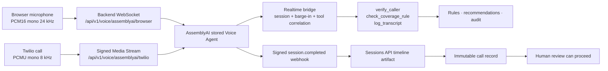

# Voice agent (AssemblyAI)

AssemblyAI is the default hosted voice provider. The application owns both browser and Twilio media transports,
keeps the provider credential on the server, and exposes the same three safety-constrained business tools used by
local mode. Automated voice service is English-only.



## What is provisioned

`scripts/assemblyai_setup.py` idempotently creates two stored agents from the same source-controlled English
prompt and audio configuration:

| Agent | Input/output | Why separate |
|---|---|---|
| Browser | signed PCM16 mono, 24 kHz | Native browser capture/playback without telephony degradation |
| Phone | G.711 PCMU mono, 8 kHz | Native Twilio Media Streams format; no application transcoding |

Both stored agents use:

- `voice/system_prompt.md`, which forbids final decisions and non-English automated intake;
- AssemblyAI's managed Voice Agent conversational model (`llm: []`), so no separate LLM Gateway entitlement is
  required;
- an English language constraint, UAE health-insurance transcription context, caller voice isolation, and
  source-derived keyterms for policy ids, procedure codes, providers and UAE terminology;
- a `session.completed` subscription pointing at `/api/v1/voice/assemblyai/post-call`.

Stored agents deliberately contain no HTTP tools. After the provider returns `session.ready`, the backend bridge
attaches exactly `verify_caller`, `check_coverage_rule`, and `log_transcript` as client-side function tools and
waits for `session.updated` before forwarding caller audio. This satisfies AssemblyAI's initial-update rule
(`agent_id` is mutually exclusive with inline configuration) while preserving trusted local tool execution and
provider-session correlation.

The generated ids and subscription ids are in git-ignored `.assemblyai-state.json`. Re-running updates the same
resources rather than creating duplicates.

## Configure and provision

Set these values in `.env`:

```dotenv
VOICE_PROVIDER=assemblyai
ASSEMBLYAI_API_KEY=...
PREAUTH_ASSEMBLYAI_VOICE_ID=...
```

`scripts/run_hosted.sh` generates independent webhook/media secrets, provisions both agents, restarts the backend
with their ids, and prints the browser and Twilio URLs. To inspect payloads without network writes:

```bash
python scripts/assemblyai_setup.py --dry-run
```

To provision manually, also set `PREAUTH_PUBLIC_BASE_URL` and
`PREAUTH_ASSEMBLYAI_WEBHOOK_SECRET`, then run:

```bash
python scripts/assemblyai_setup.py
```

The REST API uses AssemblyAI's raw API-key `Authorization` value. The realtime WebSocket uses
`Authorization: Bearer <key>`. This difference is intentional and covered by tests. The API key never appears in
browser JavaScript, TwiML, logs, or stored call metadata.

## Browser calls

With hosted mode running, open:

```text
https://<public-base-url>/voice
```

The page captures mono audio at the device's native rate, keeps browser acoustic echo cancellation enabled,
resamples it to signed PCM16 at 24 kHz in an AudioWorklet, and streams it through the backend. A separate playback
AudioWorklet resamples the provider's 24 kHz PCM packets to the device rate. Playback starts with 750 ms of speech,
when a shorter reply completes, or after 1.25 seconds with available audio. After network starvation it waits for
an adaptive 500–1000 ms reserve before continuing, with up to 1.5 seconds of starting reserve on later replies. This cuts added playback latency but a multi-second provider delivery gap can
still produce an audible pause. The page displays **Preparing the reply** during buffering. Separate reply queues
preserve reply boundaries, including when a later reply arrives before the previous one finishes playing.
Browser calls keep the microphone streaming through replies so AssemblyAI's semantic interruption detector can
hear an actual interruption; interrupted replies clear queued playback. Browser echo cancellation stays enabled,
while browser noise suppression is disabled to avoid stacking it with AssemblyAI Voice Focus. Headphones are
recommended where speaker echo causes false interruptions. Browser sessions use far-field Voice Focus for PC speakers and built-in microphones, balanced transcription to preserve identifier accuracy, and continuous partials for
steadier captions during long caller turns.
The browser requests playback-oriented hardware latency to reduce Brave/Chromium audio glitches under load.
The local recording console pauses assistant playback before recording and prevents playback during recording.
Microphone permission failures, missing devices and devices in use show actionable errors. Muted or disconnected
tracks no longer appear as listening. If the browser interrupts audio, use **Resume audio**; if the microphone
disconnects, reconnect it and start a new call. **End call** also cancels startup while permission is pending.
Use the HTTPS site address when testing from a phone; a plain HTTP LAN address cannot access the microphone.
The page displays partial user transcript events and word-level agent transcript deltas as the provider emits
them, then replaces each provisional turn with the final transcript. The backend starts the stored browser agent
only after the browser WebSocket is accepted. Microphone forwarding begins after the stored session is ready and the subsequent tool update is acknowledged; the initial `session.updated` event is not sufficient.

### Live preview, corrections and recovery

Set `PREAUTH_ASSEMBLYAI_LIVE_CAPTIONS=true` to enable the separate word-level preview. It uses AssemblyAI
Universal Streaming English at 24 kHz with raw-key authentication on the server. This adds one metered STT
connection per browser call. Packets are assembled into 50 ms frames, including short input fragments. It is terminated when the call ends. The API key never reaches the browser.
The five-second bounded queue and up to three connection attempts isolate caption congestion/failure from
voice-agent audio. An unavailable preview falls back visibly to the agent's own transcript.

**Live word preview is a second recognizer**, not the input the agent used. The conversation transcript remains
AssemblyAI Voice Agent's authoritative output, reconciled by item ID even if final events arrive late. There is
no artificial typing animation. Some updates contain several words; exact word emission latency depends on the
recognizer and network. The managed agent's native partials arrived about every 1–2 seconds in the synthetic test.

**Send correction** injects a bounded user message into the same provider session and requests a reply. The
browser cannot supply a system role or tool result. Migration `0003` saves submissions in append-only `voice_text_corrections` before transmission, because provider timelines omit injected user messages. Final call records include a separately labelled, timestamped correction supplement; submission is not claimed to be provider acknowledgement. It displays the correction only after the bridge sends it.

Live testing on 2026-09-30 confirmed saving and delivery but did not confirm that the managed agent uses the injected correction: it requested caller details already supplied in the text. The UI therefore asks callers to interrupt, repeat the detail aloud, and request readback if no acknowledgement follows. Typed correction comprehension remains an open provider integration issue.
**Interrupt & speak** immediately clears and mutes the current local reply while keeping microphone capture
active; a new reply can play normally. The underlying semantic interruption detector stays enabled.

The browser checks its connection every five seconds, detects missing microphone packets, bounds its audio-send
backlog, and shows upstream reconnection. After 20 seconds without reply progress, when the caller and playback
are quiet, it requests one recovery reply in the same session. Further retry is explicit. A dead connection
shows an actionable error and releases the microphone rather than displaying Listening forever. These controls
do not promise to repair every provider failure or eliminate acoustic echo on every PC.

## Twilio calls

Point the Twilio number's incoming-call webhook to:

```text
POST https://<public-base-url>/api/v1/voice/twilio/inbound
```

The endpoint verifies `X-Twilio-Signature` and returns TwiML containing a 90-second media token bound to the
Twilio `CallSid`, passed as a nested Stream parameter. The media WebSocket verifies the upgrade signature and
the bounded `start` message, then durably claims the token/CallSid/StreamSid before opening an upstream session.
PCMU passes through at 8 kHz; on caller interruption the bridge clears Twilio's queued output.

Required phone configuration:

```dotenv
TWILIO_AUTH_TOKEN=...
PREAUTH_PUBLIC_BASE_URL=https://...
PREAUTH_ASSEMBLYAI_PHONE_AGENT_ID=...     # populated by hosted setup
PREAUTH_ASSEMBLYAI_MEDIA_SECRET=...       # generated by hosted setup
```

## Tools and session correlation

AssemblyAI function calls execute in the backend through the existing `VoiceToolGateway` with the authoritative
AssemblyAI `session_id`. Calls run in order without blocking the provider audio receive loop. Tool results are
sent only after the associated reply completes; interrupted replies do
not leak stale results into a later turn. No function exists that can approve, deny, or finalise a case.
The bridge releases tool results after a clean `reply.done` boundary without inferring a reply id from a tool
call id. It also accepts older normal `reply.done` events that omit `status`.

That same `session_id` is written to every tool invocation. It later becomes the call-record conversation id, so
a reviewer sees `CALL_RECORD_PENDING` until the exact session transcript is durable.

If the upstream WebSocket drops, or AssemblyAI reports a retryable `server_error`, `agent_init_failed`, or
`agent_timeout`, the bridge reconnects with `session.resume` and the same session id. Recovery is limited to three
attempts inside AssemblyAI's 30-second preservation window. Browser or Twilio termination, call-identity failures,
terminal provider errors, and refused/expired resumes are not converted into a fresh session: the bridge closes
the client visibly instead of leaving a silent call or losing conversation context and transcript correlation.

## Post-call transcript and reconciliation

The signed webhook is a notification, not the transcript. The application:

1. verifies `X-AAI-Signature` against the raw body with a five-minute replay window;
2. fetches the authoritative session from the Voice Agent Sessions API;
3. returns retryable `503 WEBHOOK_ARTIFACT_PENDING` while the timeline artifact is unavailable;
4. downloads the pre-signed timeline without attaching the API key;
5. normalizes caller, agent and tool turns plus latency/confidence/interruption metrics;
6. stores one immutable call record and links it to every case touched by that session.

Deliveries are idempotent by session id. Pre-signed artifact URLs are never persisted. If delivery was exhausted
or missed, run:

```bash
python scripts/assemblyai_reconcile.py
python scripts/assemblyai_reconcile.py --agent-id <agent-id> --limit 500
```

## English-only behavior

The automated line always responds in English. If a caller cannot continue in English, it takes a name and
callback number, logs `OUT_OF_SCOPE`, and routes the request to a person. It does not translate or continue the
pre-authorisation flow. `voice/agent_tests.json` includes this behavior as a provider-dashboard acceptance case.

## Verification and live acceptance

Offline tests cover audio formats, realtime events, tool correlation, barge-in, signed media tokens, webhook
authentication/replay protection, artifact delay, provider errors, duplicate delivery, reconciliation semantics,
bounded browser/Twilio session resumption, and the transcript-before-sign-off invariant.

If the greeting plays but every later caller turn has no agent transcript or audio, retrieve the session timeline
and inspect the stored agent's `llm` field first. `scripts/assemblyai_setup.py` deliberately sends `"llm": []` on
every update; this removes stale custom-model settings that can accept the greeting but fail every generated reply.

The 2026-09-20 hosted acceptance used a 24 kHz English utterance containing a caller name and hospital name. The
public WebSocket transcribed it exactly and returned both an appropriate agent transcript and spoken audio. Keep
using representative human speech to accept:

- selected voice quality and pronunciation of policy/procedure identifiers;
- browser and Twilio first-transcript/first-audio latency;
- interruption, silence, background noise and live disconnect/resume behavior;
- concurrent-call limits, rate limiting, webhook delay and reconciliation;
- transcription accuracy versus the pre-migration baseline.

Record measured results in `MIGRATION_LOG.md` as deployment acceptance evidence.

For a repeatable transport/audio smoke test, provide a mono PCM16 24 kHz WAV:

```bash
node scripts/voice_audio_smoke.mjs \
  wss://<public-base-url>/api/v1/voice/assemblyai/browser sample.wav 45000
```


See [voice reliability](VOICE_RELIABILITY.md) for the Twilio custom-parameter handshake,
non-blocking tool dispatch, durable retries, and migration `0002` rollout requirements.
