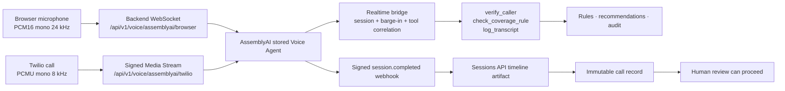

# Voice agent (AssemblyAI)

AssemblyAI is the default hosted voice provider. The application owns both browser and Twilio media transports,
keeps the provider credential on the server, and exposes the same three safety-constrained business tools used by
local mode. Automated voice service is English-only.



## What is provisioned

`scripts/assemblyai_setup.py` idempotently creates two stored agents from the same source-controlled English
prompt and tool schemas:

| Agent | Input/output | Why separate |
|---|---|---|
| Browser | signed PCM16 mono, 24 kHz | Native browser capture/playback without telephony degradation |
| Phone | G.711 PCMU mono, 8 kHz | Native Twilio Media Streams format; no application transcoding |

Both agents use:

- `voice/system_prompt.md`, which forbids final decisions and non-English automated intake;
- exactly `verify_caller`, `check_coverage_rule`, and `log_transcript`;
- AssemblyAI LLM Gateway with `gemini-2.5-flash` by default;
- source-derived keyterms for policy ids, procedure codes, providers and UAE terminology;
- a `session.completed` subscription pointing at `/api/v1/voice/assemblyai/post-call`.

The generated ids and subscription ids are in git-ignored `.assemblyai-state.json`. Re-running updates the same
resources rather than creating duplicates.

## Configure and provision

Set these values in `.env`:

```dotenv
VOICE_PROVIDER=assemblyai
ASSEMBLYAI_API_KEY=...
PREAUTH_ASSEMBLYAI_VOICE_ID=...
```

`scripts/run_hosted.sh` generates independent webhook/media secrets, provisions both agents, restarts the backend
with their ids, and prints the browser and Twilio URLs. To inspect payloads without network writes:

```bash
python scripts/assemblyai_setup.py --dry-run
```

To provision manually, also set `PREAUTH_PUBLIC_BASE_URL` and
`PREAUTH_ASSEMBLYAI_WEBHOOK_SECRET`, then run:

```bash
python scripts/assemblyai_setup.py
```

The REST API uses AssemblyAI's raw API-key `Authorization` value. The realtime WebSocket uses
`Authorization: Bearer <key>`. This difference is intentional and covered by tests. The API key never appears in
browser JavaScript, TwiML, logs, or stored call metadata.

## Browser calls

With hosted mode running, open:

```text
https://<public-base-url>/voice
```

The page captures mono audio, resamples it to signed PCM16 at 24 kHz, streams it through the backend, plays
provider audio incrementally, displays transcript events, and cancels buffered playback when the caller
interrupts. The backend starts the stored browser agent only after the browser WebSocket is accepted.

## Twilio calls

Point the Twilio number's incoming-call webhook to:

```text
POST https://<public-base-url>/api/v1/voice/twilio/inbound
```

The endpoint verifies `X-Twilio-Signature` and returns TwiML containing a 90-second media token bound to the
Twilio `CallSid`. The media WebSocket verifies the token and the `start.callSid` before forwarding audio. PCMU is
passed through at 8 kHz; on caller interruption the bridge clears Twilio's queued output.

Required phone configuration:

```dotenv
TWILIO_AUTH_TOKEN=...
PREAUTH_PUBLIC_BASE_URL=https://...
PREAUTH_ASSEMBLYAI_PHONE_AGENT_ID=...     # populated by hosted setup
PREAUTH_ASSEMBLYAI_MEDIA_SECRET=...       # generated by hosted setup
```

## Tools and session correlation

AssemblyAI function calls execute in the backend through the existing `VoiceToolGateway` with the authoritative
AssemblyAI `session_id`. Tool results are sent only after the associated reply completes; interrupted replies do
not leak stale results into a later turn. No function exists that can approve, deny, or finalise a case.

That same `session_id` is written to every tool invocation. It later becomes the call-record conversation id, so
a reviewer sees `CALL_RECORD_PENDING` until the exact session transcript is durable.

If the upstream WebSocket drops after `session.ready`, the bridge reconnects with `session.resume` and the same
session id. Recovery is limited to three attempts inside AssemblyAI's 30-second preservation window. Browser or
Twilio termination, call-identity failures, and refused/expired resumes are not converted into a fresh session:
the bridge fails closed instead of losing conversation context or transcript correlation.

## Post-call transcript and reconciliation

The signed webhook is a notification, not the transcript. The application:

1. verifies `X-AAI-Signature` against the raw body with a five-minute replay window;
2. fetches the authoritative session from the Voice Agent Sessions API;
3. returns retryable `503 WEBHOOK_ARTIFACT_PENDING` while the timeline artifact is unavailable;
4. downloads the pre-signed timeline without attaching the API key;
5. normalizes caller, agent and tool turns plus latency/confidence/interruption metrics;
6. stores one immutable call record and links it to every case touched by that session.

Deliveries are idempotent by session id. Pre-signed artifact URLs are never persisted. If delivery was exhausted
or missed, run:

```bash
python scripts/assemblyai_reconcile.py
python scripts/assemblyai_reconcile.py --agent-id <agent-id> --limit 500
```

## English-only behavior

The automated line always responds in English. If a caller cannot continue in English, it takes a name and
callback number, logs `OUT_OF_SCOPE`, and routes the request to a person. It does not translate or continue the
pre-authorisation flow. `voice/agent_tests.json` includes this behavior as a provider-dashboard acceptance case.

## Verification and live acceptance

Offline tests cover audio formats, realtime events, tool correlation, barge-in, signed media tokens, webhook
authentication/replay protection, artifact delay, provider errors, duplicate delivery, reconciliation semantics,
bounded browser/Twilio session resumption, and the transcript-before-sign-off invariant.

Real credentials and representative English audio are still required to accept:

- selected voice quality and pronunciation of policy/procedure identifiers;
- browser and Twilio first-transcript/first-audio latency;
- interruption, silence, background noise and live disconnect/resume behavior;
- concurrent-call limits, rate limiting, webhook delay and reconciliation;
- transcription accuracy versus the pre-migration baseline.

Record measured results in `MIGRATION_LOG.md` before removing the rollback provider.

## Rollback

Set `VOICE_PROVIDER=elevenlabs`, restore the old ElevenLabs variables/webhook target, and restart. The legacy
adapter, setup script, webhook endpoint, tests, and state file remain during live acceptance. Rollback does not
delete or modify AssemblyAI agents or subscriptions.
